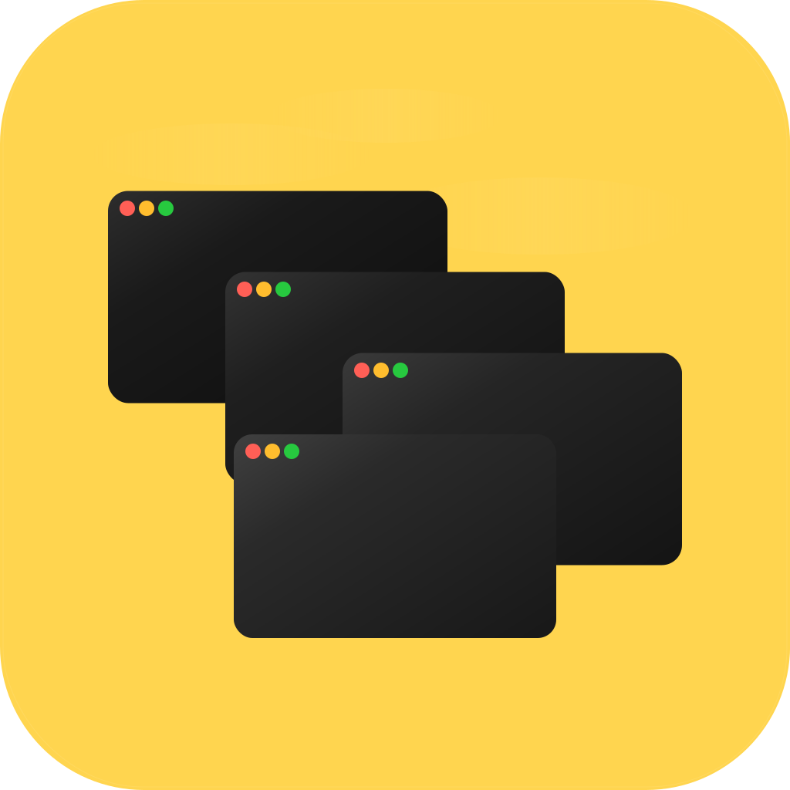

<p align="center">
    
</p>

# WindNav

WindNav is a macOS keyboard navigation tool for fast app and window switching without rearranging your workspace.

## Features

- Fast directional app switching with `left` / `right`.
- Window selection with `up` / `down` in both immediate and browse flows.
- Flow lock per modifier hold for predictable behavior.

## How It Works (Quick Guide)

1. Hold your modifier key (default: `Command`).
2. The first arrow you press locks the flow for this hold.
3. `left` / `right` first => immediate navigation flow.
4. `up` / `down` first => browse flow (deferred focus).
5. In browse flow, `left` / `right` selects app; `up` / `down` selects window.
6. Release the modifier to commit only in browse flow.

## Default Shortcuts

- `cmd-left`: previous app (immediate)
- `cmd-right`: next app (immediate)
- `cmd-up`: open browse HUD / next window in selected browse app
- `cmd-down`: open browse HUD / previous window in selected browse app

## Config

Config file location:

```text
~/.config/windnav/config.toml
```

WindNav creates this file automatically on first launch.

Opinionated Example:

```toml
[hotkeys]
focus-left = "cmd-left"
focus-right = "cmd-right"
focus-up = "cmd-up"
focus-down = "cmd-down"

[navigation]
mode = "standard"
cycle-timeout-ms = 0
include-minimized = true
include-hidden-apps = true

[navigation.standard]
pinned-apps = ["com.openai.codex", "dev.zed.Zed", "com.mitchellh.ghostty"]
unpinned-apps = "append"
in-app-window = "last-focused"
grouping = "one-stop-per-app"

[startup]
launch-on-login = true

[logging]
level = "info"
color = "auto"

[hud]
enabled = true
show-icons = true
position = "middle-center"
```

## Tips

- Set `cycle-timeout-ms = 0` to keep immediate cycling sessions active until you release the shortcut modifiers.
- The window-number pill counts all standard windows for the selected app, including off-screen / Stage Manager windows.
- If the exact selected window slot cannot be resolved, the HUD falls back to highlighting window `1`.
- Bundle ID tip for `navigation.standard.pinned-apps`:
  `osascript -e 'id of app "App"'`
- Restart WindNav after editing `config.toml`.

## Troubleshooting

- **Shortcuts do nothing**: Re-check macOS Accessibility permission for WindNav.
- **Config changes not applied**: Quit and relaunch WindNav.

## Development Run

```bash
cd /path/to/WindNav
swift run WindNav
```
