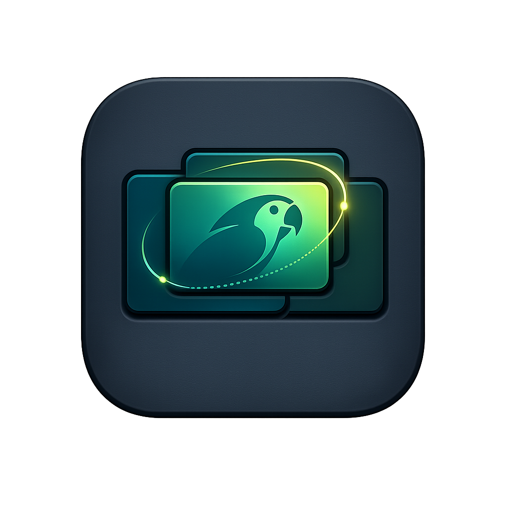

<p align="center">
    
</p>

# WindNav

WindNav is a lightweight macOS keyboard navigation agent.
It preserves your current window layout and only changes focus.

## Features (v1)

- Global hotkeys via Carbon (`RegisterEventHotKey`)
- AX window discovery for visible standard windows
- Predictable app-level focus cycling (`left/right`) with in-app window cycling (`up/down`)
- Modifier+Tab HUD trigger with hold-to-preview cycling and release-to-commit
- Current-monitor-only targeting
- TOML config (loaded on startup)

## Config

Path: `~/.config/windnav/config.toml`

```toml
[hotkeys]
focus-left = "cmd-left"
focus-right = "cmd-right"
focus-up = "cmd-up"     # in-app window cycling (forward)
focus-down = "cmd-down" # in-app window cycling (reverse)
hud-trigger = "cmd-tab" # first press shows HUD only, repeated Tab cycles selection

[navigation]
policy = "fixed-app-ring" # currently fixed-app-ring is the only active policy
cycle-timeout-ms = 900
# set to 0 to keep cycling active until you release hotkey modifiers

[navigation.hud-trigger]
tab-direction = "right"              # right|left
on-modifier-release = "focus-selected" # focus-selected|hide-only

[logging]
level = "info" # info|error
color = "auto" # auto|always|never

[startup]
launch-on-login = false

[hud]
enabled = false
show-icons = false
position = "top-center"
```

`left/right` cycle apps in the configured ring.
`up/down` cycle windows within the selected app.
Set `navigation.cycle-timeout-ms = 0` to disable time-based session reset and end cycling (and hide HUD) when modifiers are released.
`hotkeys.hud-trigger` must be `Modifier+Tab`. First press shows HUD without changing focus. Additional Tab presses while modifiers stay down move HUD selection using `navigation.hud-trigger.tab-direction`.
On modifier release, WindNav either focuses the selected window (`focus-selected`) or hides HUD only (`hide-only`).
When `hotkeys.hud-trigger` uses Command+Tab, WindNav temporarily disables native macOS Command-Tab while running and restores it when exiting.
Config changes are applied on startup. Restart WindNav after editing `config.toml`.
`launch-on-login` is applied on startup.
HUD positions: `top-center`, `middle-center`, `bottom-center`.

## Log Output

WindNav writes structured logs to stdout:

```text
[07:10:11] Runtime    -> Starting WindNav
[07:10:11] Config     -> Loaded config from /Users/balli/.config/windnav/config.toml
[07:10:11] Startup    -> Launch-on-login already disabled (status=notRegistered)
[07:10:11] Hotkey     -> Registered left (keyCode=123, modifiers=256)
[07:10:13] Hotkey     -> Hotkey pressed: right
[07:10:13] Navigation -> Direction=right focused=52361 candidates=5
[07:10:13] Navigation -> Focused target window 52403
```

Launch-at-login can additionally log:

```text
[07:10:11] Startup    -> Applying launch-on-login=true (status-before=notRegistered)
[07:10:11] Startup    -> Launch-on-login set requested=true status-after=enabled
[07:10:11] Startup    -> Launch-on-login set requested=true status-after=requiresApproval
[07:10:11] Startup    -> Failed to apply launch-on-login=true; continuing startup: <error>
```

## Run (Dev)

```bash
cd /Users/balli/code/WindNav
swift run WindNav
```

On first launch, grant Accessibility permission when prompted.
If `launch-on-login` is enabled, run as bundled app (`dist/WindNav.app`) for `SMAppService.mainApp` registration behavior.
When running with `swift run WindNav`, launch-at-login registration can fail and is logged but non-fatal.
When running as `dist/WindNav.app`, stdout/stderr are redirected to `/tmp/windnav.log`.

## Build (Release Binary)

```bash
cd /Users/balli/code/WindNav
swift build -c release --product WindNav
```

Binary output:

```text
/Users/balli/code/WindNav/.build/arm64-apple-macosx/release/WindNav
```

## Build App Bundle With Icon

WindNav uses repo-owned icon assets:

```text
/Users/balli/code/WindNav/Packaging/windnav.svg
/Users/balli/code/WindNav/Packaging/windnav.icns
```

Build app bundle (no args):

```bash
cd /Users/balli/code/WindNav
./scripts/build_app.sh
```

Bundle output:

```text
/Users/balli/code/WindNav/dist/WindNav.app
```

Launch:

```bash
open /Users/balli/code/WindNav/dist/WindNav.app
```

Defaults:

- `Bundle ID`: `com.windnav.app`
- signing: skipped
- app type: background agent (`LSUIElement=true`)
